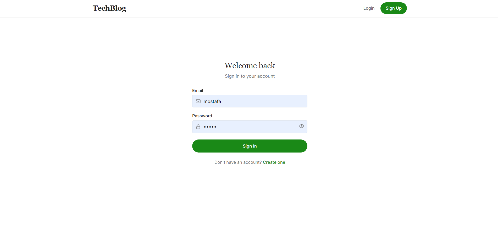
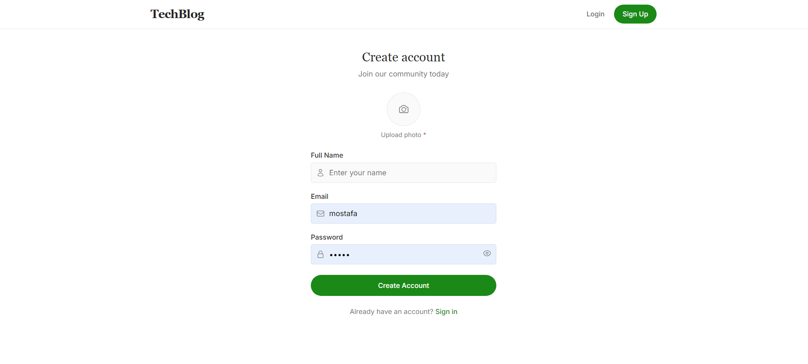
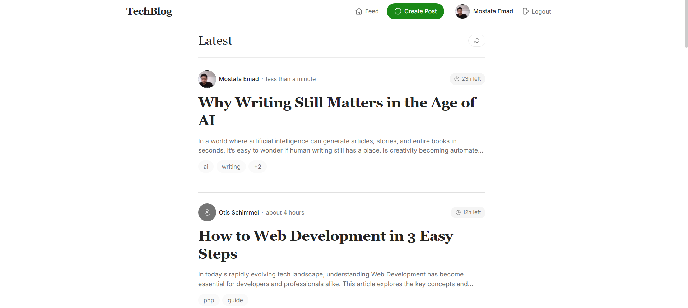
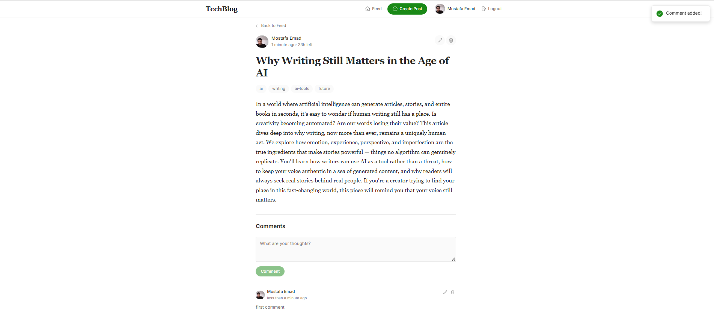
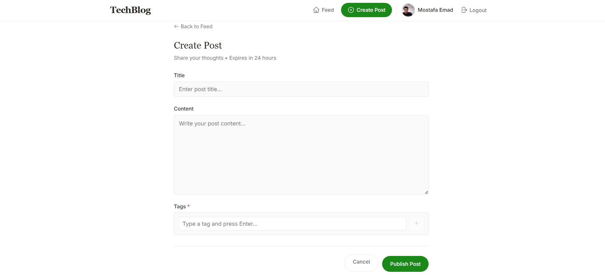
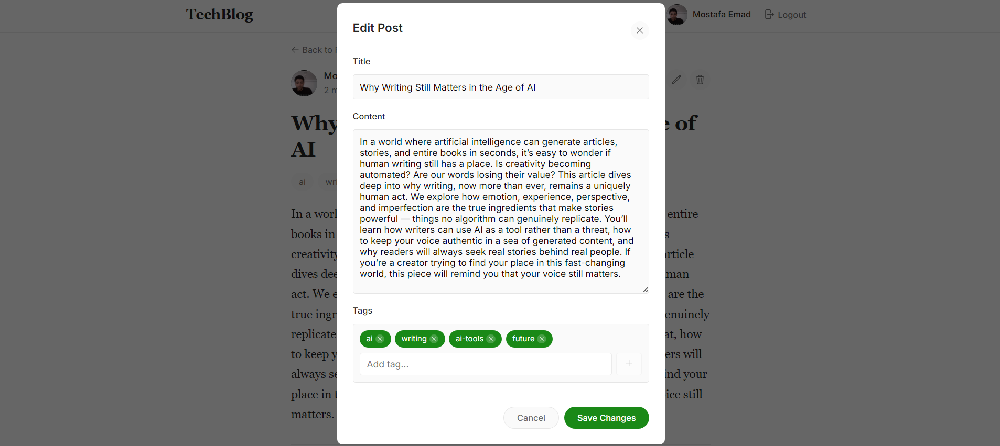
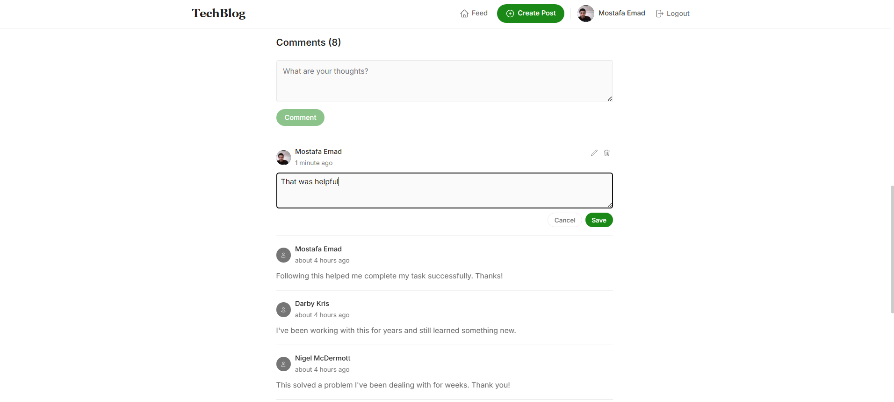

<p align="center">
  
  
  
  
  
</p>

# 📝 Blog Application

A modern, full-stack Blog Application built with **Laravel 12** (Backend API) and **React 19** (Frontend). Features JWT authentication, auto-expiring posts, tagging system, comments, and a beautiful responsive UI.

---

## 📑 Table of Contents

- [Features](#-features)
- [Tech Stack](#️-tech-stack)
- [Installation (Docker)](#-installation-docker-recommended)
- [Installation (Manual)](#-installation-manual)
- [Screenshots](#-screenshots)
- [API Documentation](#-api-documentation)
- [Testing](#-testing)
- [Project Structure](#-project-structure)

## ✨ Features

### 🔐 Authentication

- JWT-based authentication system
- User registration with profile image upload
- Secure login/logout functionality
- Protected routes and API endpoints

### 📰 Posts Management

- Create, Read, Update, Delete posts
- Rich text content support
- **Auto-expiry**: Posts automatically expire after 24 hours
- Tagging system with dynamic tag creation
- Author-only edit/delete permissions

### 💬 Comments System

- Add comments to any post
- Edit and delete your own comments
- Real-time comment count updates
- Paginated comment loading

### ⚡ Performance & Infrastructure

- Redis caching for optimized performance
- Queue system for background jobs
- Scheduled task for expired post cleanup
- Nginx reverse proxy for production
- Fully containerized with Docker

### 🎨 Modern UI/UX

- Clean, responsive design inspired by Medium/Substack
- Infinite scroll feed
- Real-time countdown timer for post expiry
- Mobile-friendly layout
- Dark/light theme ready structure

---

## 🛠️ Tech Stack

| Layer                      | Technology                  |
| -------------------------- | --------------------------- |
| **Backend**          | Laravel 12, PHP 8.2         |
| **Frontend**         | React 19, Vite, CSS Modules |
| **Database**         | MySQL 8.0                   |
| **Cache/Queue**      | Redis Alpine                |
| **Web Server**       | Nginx Alpine                |
| **Containerization** | Docker, Docker Compose      |
| **Authentication**   | JWT (tymon/jwt-auth)        |

---

## 🐳 Installation (Docker) - Recommended

### Prerequisites

- Docker installed and running
- Git

### Step 1: Clone the Repository

```bash
git clone https://github.com/mostafa123c/Tech-Blog.git
cd Tech-Blog
```

### Step 2: Configure Environment

Create the Laravel `.env` file:

```bash
cp Backend/.env.example Backend/.env
```

Update the database credentials in `Backend/.env`:

```env
DB_CONNECTION=mysql
DB_HOST=mysql
DB_PORT=3306
DB_DATABASE=blog_db
DB_USERNAME=blog_user
DB_PASSWORD=blog_password

REDIS_HOST=redis
CACHE_DRIVER=redis
SESSION_DRIVER=redis
QUEUE_CONNECTION=redis
```

### Step 3: Build and Start Containers

```bash
docker-compose up --build -d
```

This command starts the following services:

- **blog-nginx** - Reverse proxy (Port 80)
- **blog-backend** - Laravel API (PHP-FPM)
- **blog-frontend** - React app (Nginx)
- **blog-mysql** - MySQL 8.0 database (Port 33061)
- **blog-redis** - Redis cache
- **blog-queue** - Laravel queue worker
- **blog-scheduler** - Laravel scheduler
- **blog-phpmyadmin** - Database GUI (Port 8080)

### Step 4: Run Migrations & Seed Database

```bash
docker exec -it blog-backend php artisan migrate:fresh --seed
```

This creates the database tables and populates them with demo data:

- 11 demo users
- 30 tags
- 267 sample posts with comments

### Step 5: Access the Application

| Service              | URL                                         |
| -------------------- | ------------------------------------------- |
| **Frontend**   | [http://localhost](http://localhost)           |
| **API**        | [http://localhost/api](http://localhost/api)   |
| **phpMyAdmin** | [http://localhost:8080](http://localhost:8080) |

### Database Access

**phpMyAdmin:**

- URL: `http://localhost:8080`
- Auto-login enabled (root/password)

**MySQL CLI:**

```bash
docker exec -it blog-mysql mysql -u root -ppassword blog_db
```

**External Client (MySQL Workbench, DBeaver, etc.):**

- Host: `localhost`
- Port: `33061`
- User: `root`
- Password: `password`
- Database: `blog_db`

### Docker Commands Reference

```bash
# Start all services
docker-compose up -d

# Stop all services
docker-compose down

# Stop and remove volumes (fresh start)
docker-compose down -v

# View logs
docker logs -f blog-backend

# Execute artisan commands
docker exec -it blog-backend php artisan <command>

# Run tests
docker exec -it blog-backend php artisan test
```

---

## 💻 Installation (Manual)

### Prerequisites

- PHP 8.2+
- Composer
- Node.js 18+
- MySQL 8.0
- Redis

### Backend Setup

```bash
# Navigate to backend directory
cd Backend

# Install PHP dependencies
composer install

# Copy environment file
cp .env.example .env

# Generate application key
php artisan key:generate

# Generate JWT secret
php artisan jwt:secret

# Run migrations and seed
php artisan migrate:fresh --seed

# Create storage link
php artisan storage:link

# Start the server
php artisan serve
```

### Frontend Setup

```bash
# Navigate to frontend directory
cd Frontend

# Install dependencies
npm install

# Start development server
npm run dev
```

### Start Queue Worker (Optional)

```bash
cd Backend
php artisan queue:work
```

### Start Scheduler (Optional)

```bash
cd Backend
php artisan schedule:work
```

---

## 📸 Screenshots

#### Login Page



#### Register Page



#### Feed / Home Page



#### Post Detail Page



#### Create Post Page



#### Edit Post Page



#### Comments Section



</details>

---

## 📚 API Documentation

Full API documentation is available in [API_DOCUMENTATION.md](./API_DOCUMENTATION.md).

### Quick API Overview

| Endpoint                     | Method | Description        |
| ---------------------------- | ------ | ------------------ |
| `/api/register`            | POST   | Register new user  |
| `/api/login`               | POST   | User login         |
| `/api/logout`              | POST   | User logout        |
| `/api/me`                  | GET    | Get current user   |
| `/api/posts`               | GET    | List all posts     |
| `/api/posts`               | POST   | Create new post    |
| `/api/posts/{id}`          | GET    | Get single post    |
| `/api/posts/{id}`          | PUT    | Update post        |
| `/api/posts/{id}`          | DELETE | Delete post        |
| `/api/posts/{id}/comments` | GET    | List post comments |
| `/api/posts/{id}/comments` | POST   | Add comment        |
| `/api/comments/{id}`       | PUT    | Update comment     |
| `/api/comments/{id}`       | DELETE | Delete comment     |

### Postman Collection

Import the Postman collection for testing:

- [Blog-Rawmart.postman_collection.json](./Backend/Blog-Rawmart.postman_collection.json)

---

## ✅ Testing

### Run All Tests

```bash
# Using Docker
docker exec -it blog-backend php artisan test

# Manual Setup
cd Backend && php artisan test
```

### Run Specific Test Suite

```bash
# Feature tests only
docker exec -it blog-backend php artisan test --testsuite=Feature

# Unit tests only
docker exec -it blog-backend php artisan test --testsuite=Unit
```

---

## 📁 Project Structure

```
Blog-Task-Rawmart/
├── Backend/                    # Laravel API
│   ├── app/
│   │   ├── Http/
│   │   │   ├── Controllers/   # API Controllers
│   │   │   ├── Middleware/    # Auth & other middleware
│   │   │   └── Requests/      # Form validation
│   │   ├── Models/            # Eloquent models
│   │   ├── Jobs/              # Queue jobs
│   │   └── Traits/            # Reusable traits
│   ├── database/
│   │   ├── migrations/        # Database migrations
│   │   └── seeders/           # Data seeders
│   ├── routes/
│   │   └── api.php            # API routes
│   └── Dockerfile
│
├── Frontend/                   # React Application
│   ├── src/
│   │   ├── components/        # Reusable components
│   │   ├── pages/             # Page components
│   │   │   ├── Auth/          # Login, Register
│   │   │   ├── Feed/          # Posts feed
│   │   │   ├── PostDetail/    # Single post view
│   │   │   └── PostForm/      # Create/Edit post
│   │   ├── services/          # API services
│   │   ├── context/           # React Context
│   │   └── config/            # Configuration
│   └── Dockerfile
│
├── .docker/                    # Docker configurations
│   └── nginx.conf             # Nginx proxy config
│
├── docker-compose.yml          # Docker orchestration
├── API_DOCUMENTATION.md        # Full API docs
└── README.md                   # This file
```
